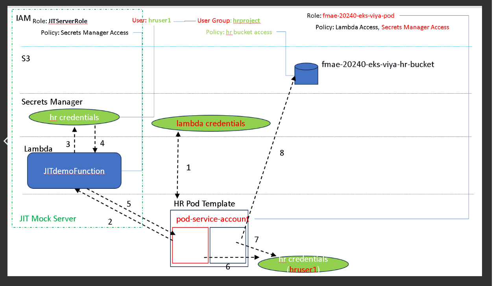
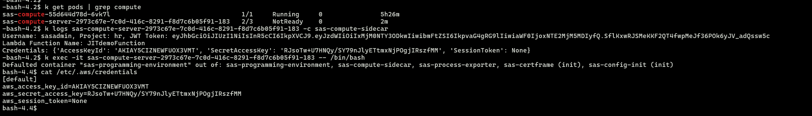

## Lambda Function
Receive and Parse the Incoming Event:

The Lambda function is designed to handle incoming events that include a JWT token, user ID, and project name.
Initialize the AWS Secrets Manager Client:

The function begins by creating a session and client to interact with AWS Secrets Manager.
Retrieve Secret from Secrets Manager:

Using the secret's ARN, the function retrieves the secret AWS key pairs associated with the specified project from Secrets Manager.
Process Response:

After retrieving the AWS keys, the response is formatted as response.json.

## ConfigMap Logic
The ConfigMap is structured to perform the following steps:

1. Lambda Invocation:

From the sidecar container attached to compute pod, the Lambda function is invoked using the username, JWT token, and project name. These parameters are obtained from Kubernetes labels. 


2. Process Response JSON:

The response.json from the Lambda invocation is processed as required in this block(Logic is in config map). The AWS credentials are then written to a credentials file located in the /etc/.aws shared mount volume with compute. This setup enables the corresponding project user to access the S3 bucket.

Policies and Roles


## Group Policies:

Group policies for each project can be created using a standard template policy (project_group_policy).
Lambda Execution Role Policy:

Lambda specific policy (lambda_execution_role_permission) allows the Lambda function to execute and access secrets, along with its associated assume role policy.

Service Account Role Policy:

This policy (service_account_role) provides the role necessary to invoke the Lambda function from the EKS cluster, which is enabled with IRSA/OIDC. The associated assume role policy is also defined.

Enabling IRSA and linking the SA with above role is the key step for the cluster to get reqired access. ARN of this IAM role should be linked with SA annotation.  https://eksctl.io/usage/iamserviceaccounts/

This project contains the implementation code for setting up SAS Viya custom context. Below are the instructions for creating the necessary AWS resources using AWS CLI commands.


## Prerequisites

Ensure you have the following:

AWS CLI installed and configured with appropriate access rights.
Necessary IAM permissions to create resources.


## Steps to Create AWS Resources
```bash

Create an IAM policy that grants permissions to access the secrets in AWS Secrets Manager. This policy is added to IAM role that will be used by the lambda. When Lambda is invoked with expected param's lambda can access corresponding project keys. 
cat > permissions-policy.json <<EOF

{
    "Version": "2012-10-17",
    "Statement": [
        {
            "Effect": "Allow",
            "Action": [
                "secretsmanager:GetSecretValue"
            ],
            "Resource": [
                "arn:aws:secretsmanager:us-east-1:612185499948:secret:hr_secret-jaaSAI",
                "arn:aws:secretsmanager:us-east-1:612185499948:secret:marketing_secret-TgV5qz",
                "arn:aws:secretsmanager:us-east-1:612185499948:secret:sales_secret-RxJc8j"
            ]
        }
    ]
}

Trust Policy for the Lambda Role: 
cat > trust-policy.json <<EOF

{
    "Version": "2012-10-17",
    "Statement": [
        {
            "Effect": "Allow",
            "Principal": {
                "Service": "lambda.amazonaws.com"
            },
            "Action": "sts:AssumeRole"
        }
    ]
}

Create an IAM role and attach the policy created in the previous step:

aws iam create-role --role-name LambdaRole --assume-role-policy-document file://trust-policy.json
aws iam put-role-policy --role-name LambdaRole --policy-name SecretsManagerAccess --policy-document file://permissions-policy.json

4. Secrets manager
Below commands creates aws creds for each project group.  (HR,Sales and Marketing) 
aws secretsmanager create-secret --name hr_secret --secret-string '{"access_key":"your_hr_access_key","secret_key":"your_hr_secret_key"}'
aws secretsmanager create-secret --name sales_secret --secret-string '{"access_key":"your_sales_access_key","secret_key":"your_sales_secret_key"}'
aws secretsmanager create-secret --name marketing_secret --secret-string '{"access_key":"your_marketing_access_key","secret_key":"your_marketing_secret_key"}'

Create Lambda Funtion: 

Python code for lambda zipped in a package and loaded into lambda, Also adding IAM role created from above step create required layers accordingly
zip function.zip lambda_function.py

aws lambda create-function --function-name JITServerFunction \
   --zip-file fileb://function.zip --handler lambda_function.lambda_handler --runtime python3.8 \
   --role arn:aws:iam::your-account-id:role/LambdaRole


Service account IAM role: (IRSA) Comes from Craigs automation. I  modified the existing policy attached to this role

Policy to be added to IAM role used by Service account(hr-service-account) - Update existing policy of IAM role used and replace with below policy (Enable cluster to access Lambda using SA).  

{
    "Version": "2012-10-17",
    "Statement": [
        {
            "Effect": "Allow",
            "Action": [
                "lambda:InvokeFunction"
            ],
            "Resource": "arn:aws:lambda:us-east-1:612185499948:function:JITdemoFunction"
        }
    ]
}


aws iam create-policy-version --policy-arn arn:aws:iam::612185499948:policy/fmae-20240-eks-viya-writeaccess-hr-bucket --policy-document file://sa_role_policy.json --set-as-default 


Create AWS user groups for the departments and add group policy to each group with permission to access thier corresponding project buckets:
Group policy for the Project (IAM user group): Similar policy for other groups also needs to be created and added to their respective groups. 
To create a Group policy with s3 access to project bucket: 
{
    "Version": "2012-10-17",
    "Statement": [
        {
            "Effect": "Allow",
            "Action": [
                "s3:GetObject",
                "s3:PutObject"
            ],
            "Resource": [
                "arn:aws:s3:::fmae-20240-eks-viya-hr-bucket/*"
            ]
        },
        {
            "Effect": "Allow",
            "Action": [
                "s3:ListBucket"
            ],
            "Resource": [
                "arn:aws:s3:::fmae-20240-eks-viya-hr-bucket"
            ]
        }
    ]
}

Create aws group and associate user to the group with above created group policy:
aws iam create-policy \
    --policy-name <PolicyName> \
    --policy-document file://policy.json

aws iam create-group --group-name <GroupName>

aws iam add-user-to-group --user-name <UserName> --group-name <GroupName>

aws iam attach-group-policy --policy-arn arn:aws:iam::aws:policy/<PolicyName> --group-name <GroupName>


Changes to viya deployment: 

Move sidecar_configmap.yaml to viya deployment folder site-config/compute 
kustomize build and apply 

Update compute context with sidecar information: 

cd /Data/s3-access//contexts/overlays

move project_pod_template.yaml to corresponding project folder 
update pod-template name and project label accordinlgy
service account is common for all 3 projects in poc. hr-service-account(lets cluster to invoke lambda)  

After updating run managecontext.sh 
verify the podtemplates having all our changes in place. 

At this point configuration is completed you should be able to initiate a compute session for each user group user with proc execution to list s3 buckets. You would be able to list buckets based on the compute sessions corresponding to projects/users.   

Also you can exec into compute pods and validate the aws creds for their project were downloaded into path /etc/.aws/credentials (shared mount volume) 
```
## Credentials downloaded for the project by invoking lambda


## Authenctation successful when accessing the bucket for the associated user group (HR compute)


## Authenctation rejected when accessing the bucket of another user group (HR compute trying to access sales bucket)


## Lamda response when invoked manually with payload : Ideally if you change the project name you can see its response with different keys same happens inside the pod.  This response is processed and written to /etc/.aws/credentias which a shared mount between sidecar and compute pod


## From the aws console you can test with below payload


